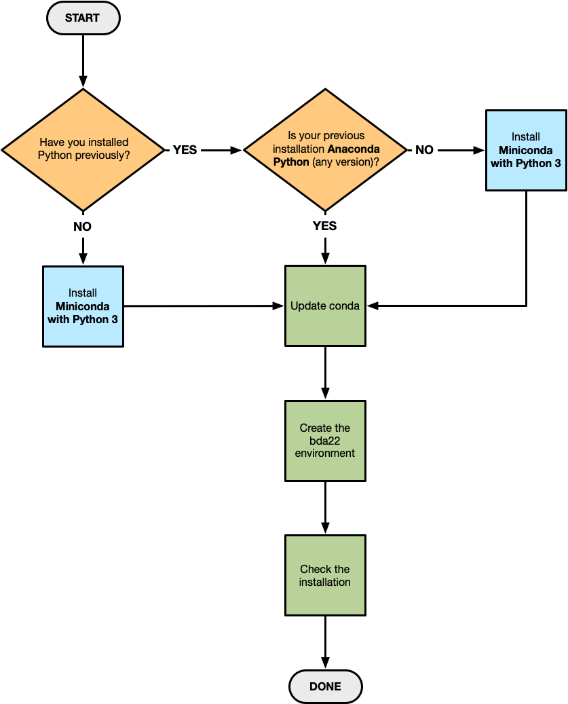

# Python setup for STSCI 4780/5780

We will make heavy use of the Python high-level computing language, specifically the CPython-3.9 implementation (usually just called Python-3.9; the "C" indicates it's implemented in the C language). We will also use many Python packages that are not part of Python itself, particularly the collection of packages known informally as the **PyData stack** (e.g., packages providing fast numerical computing capability, plotting, and of course statistical computing tools; see [python - The PyData Ecosystem - Stack Overflow](https://stackoverflow.com/questions/18168400/the-pydata-ecosystem) for a list, and for other uses of the "PyData" nomicker).

A **Python distribution** is a software bundle that provides Python along with a curated set of third-party libraries.
If your operating system has Python built in, you probably still want to install a new distribution; please read on.

**Linux and Mac operating systems** come with a version of Python pre-installed, but even on these systems it is highly recommended that one use a separate Python installation for data science software development. The OS's Python is often several versions out of date, and will not have all the needed packages. Modifying it (by upgrading Python itself, or by updating or adding packages) can be troublesome since some system software may rely on the OS's Python and package versions.

**Windows** does not come with Python, so Windows users will have to install Python.  (If you have installed a Linux environment for Windows, such as [Windows Subsystem for Linux (WSL)](https://docs.microsoft.com/en-us/windows/wsl/), Cygwin, or MinGW, or a Linux virtual machine, you may have Python, but you should still consider installing a separate Python development environment, for the reasons given in the previous paragraph).

You can install a new version of Python by itself, and install and maintain the packages we'll need one by one. It's doable, but quite a headache, and it makes it hard to share code or collaborate on development, since your environment will likely differ from your collaborators' environments.  


## Anaconda Python distribution

We strongly recommend that all BDA students use the **Anaconda Python distribution** (the Python-3.9 version), a distribution *specifically curated to support data science*.
It is free (though there is a commercial version), contains most of the software we need, and provides package management and *virtual environment* capabilities not readily available otherwise, via the included **`conda` package management system**. It supplies compiled binary libraries built with optimized compilers that you may not have easy access to.  It is also very widely used across the data science community (academic and commercial).

We will help with installation and operation issues only for Anaconda Python. It requires a few GB of disk space for a new installation. It may take a while to download and install everything; budget time for this appropriately.

The [Anaconda Individual Distribution main page](https://www.anaconda.com/products/individual) provides a graphic showing you some of the data science content included in the distribution, and links to download basic installers for Windows, macOS, and Linux. Do **not** immediately install Anaconda using one of these links (it won't hurt if you do, but the alternative we recommend below has benefits).

To set up Anaconda for STSCI 4780/5780, follow the flowchart below. You will have to execute **at most one** of the operations in a blue box. You will have to do **all** of the operations in the green boxes. Details for each operation are provided below.  **Don't execute them all**; rather, follow the flowchart, using the instructions below as needed. (The reason for the various options is to make sure that the Anaconda setup for this class doesn't interfere with any other Python distribution you may need for other work.)

*Note:* During parts of the installation or environment creation process, you may see instructions displayed about setting up `dbus`. This is a Linux application communication tool that we won't be using, so you may safely ignore these instructions.


### Anaconda installation flowchart



### Install Miniconda with Python 3

The many components comprising Anaconda may be installed in two different ways:

* Installing Anaconda directly, which will give you a large default Python installation immediately accessible on the command line, and the `conda` package manager. This is a good choice for users who plan to work with Python on a single project.

* Installing **Miniconda**, a streamlined version that provides immediate access only to a basic Python distribution, and the `conda` package manager. This is a good choice for users who plan to create one or more **coda environments** that isolate a collection of Python packages for use on a particular project (or set of related projects, e.g., your course assignments). This is the approach we recommend. 

Miniconda  installs a subset of the full Anaconda distribution, so as not to interfere with other Python content you may have on your computer. You will add further content later, in a protected *conda environment*. There isn't a 100% guarantee that this will not affect all other Python installations, but it's very likely to work. If you are concerned about this, have a look at: [Installing conda on a system that has other Python installations or packages](https://docs.conda.io/projects/conda/en/latest/user-guide/install/index.html#installing-conda-on-a-system-that-has-other-python-installations-or-packages).

If you've already installed the full Anaconda package, that will not be a problem; the instructions below will have you set up an environment for the course that will work identically to an environment based on Miniconda. The Miniconda approach is just a bit more efficient, and it will help make sure that you don't inadvertently work on your assignments in an incorrect environment (since Miniconda's default environment will not be able to run your course code).

**Install Miniconda** as follows:

* Visit the [Regular installation documentation](https://docs.conda.io/projects/conda/en/latest/user-guide/install/index.html#regular-installation), follow the link for your platform, and get the Miniconda installer appropriate for your computer. E.g., for Windows you'll have to choose between 32-bit and 64-bit; for macOS choose the "64-bit pkg" version (use this even if you have an M1 Mac; the M1 version does not yet support Python-3.9).
* Follow the remaining instructions. Windows users will launch a standard `.exe` installer, and Mac users will launch a standard `.pkg` installer. Linux users will have to run a command-line command to do the installation.
* You may see requests for disk access permissions; this is needed to install the distribution (almost all of it gets installed in a new folder in your user account). If you are a regular terminal/command line user who has customizations in shell profile files, you may see a request to alter your profile; accept it (unless you're an expert and plan to handle command path management yourself). 

**Windows users:** Anaconda/Miniconda installs a Windows program called `Anaconda Prompt` (available in the Start Menu), similar to how the Windows Git installers install `Git Bash`. If you launch `Anaconda Prompt`, you'll get a console/terminal window all set up for accessing Anaconda. (For Linux and macOS users, any terminal session will have access.)


### Update `conda`

A key ingredient of the Anaconda distribution is the **`conda` package management system**.  `conda` is a command-line package manager that can be used to upgrade components of the Anaconda distribution, or to specify specific versions of the components to use. One of its most important capabilities is support of **virtual environments**: collections of packages (Python and/or non-Python packages) that can be tailored to a particular project, and kept isolated from your operating system or the base Anaconda installation. *This is an important capability.*  We'll use it to specify an environment for working on class assignments.

_**ALL USERS**_ should update the `conda` system, even if you have previously installed Anaconda (in fact, *especially* if you have previously installed it). There are bugs in past versions of `conda` that have been repaired.  Also, the installer downloads are only updated when many Anaconda packages have been upgraded; the Anaconda team assumes users will immediately update `conda` and they don't update the installers if only `conda` has changed.

To update `conda`:

* Open up a terminal (e.g., the Windows Anaconda Prompt, macOS Terminal, or a Linux xterm).
* Simply run `conda update conda`.  Accept any downloads or other changes it offers to make.


### Create the bda22 environment

The safest way to work is to compartmentalize work for this course using a `conda` environment, so I strongly recommend that **all users** do this step, even if you have a full Anaconda default environment that you are used to working in.

In a terminal session (you need not be in any specific location), enter this command (it may take a while to finish, especially if you installed Miniconda instead of the full Anaconda):

```
conda create -n bda22 python=3.9 anaconda
```

Again, accept any downloads or other changes conda asks you to agree to. You may see a message about installing a package to accelerate `scikit-learn`; you may ignore that.

This process creates an environment named `bda22` that has access to the full Anaconda distribution using Python-3.9.  Later, we'll be adding other packages to this environment.  By working in an environment, we can make sure that any changes we make to our Python installation don't impact any other Python work you may do.

_**NOTE THE FOLLOWING:**_ You will need to activate the `bda22` environment every time you do work for the course (including when you launch Jupyter notebooks). So memorize the instructions below (but don't execute them right now). Command line experts may wish to create short *aliases* for these commands.

FYI: Activation runs a shell script that changes environment variables in the current shell that tell the shell where to find commands and other resources.  This will sometimes display a lot of environment variable values on your terminal; this is fine (as long as there are no errors).

**To activate the environment:**

*  On macOS and Linux, in your Terminal Window, or on Windows, in Anaconda Prompt; run:
  ```
  conda activate bda22
  ```
  

**To deactivate the environment:**

* In your Terminal Window or in Anaconda Prompt, run:
  `conda deactivate`
  

Activating an environment *only affects the current terminal session in which you entered the command*. You probably won't need to deactivate `bda22` often (if at all). When you close your terminal or Anaconda Prompt session, the environment choice will be forgotten.

(Windows users who have used Anaconda in the past but not recently should note that the environment commands have changed; the Windows command to activate an environment used to be `activate bda22`, and to deactivate it, `deactivate`. See: [conda docs — Managing environments](https://conda.io/projects/conda/en/latest/user-guide/getting-started.html#managing-environments).)


### Check the installation

Check that three key components work:

* Launch a terminal and activate `bda22`. *Make sure you activate the environment!*
* Run the **Python interpreter** by typing `python` and hitting `return`. It should type out a line or two of info identifying itself as Python 3.9.x  (for some "x"); it will also likely identify itself as being part of Anaconda.  It will show the Python prompt:  `>>>`. At this point, you can type `Ctl-D` to quit—or play with Python if you wish.
* Run the **IPython interpreter**. This is a souped-up Python interpreter.  Type `ipython` and hit `return`. This time the message will identify the IPython version (7.x.y) and the Python version, and end with the IPython prompt, `In [1]:`.  As with Python, `Ctl-D` quits (though it may prompt to verify you want to quit).
* Finally, check that the **Jupyter notebook** system works.  Type `jupyter notebook` and hit `return`.  This should open a tab in your default web browser—the notebook works in a web browser. You may then quit Jupyter notebook in two steps:  Close the browser tab, and then back in the terminal session, type `Ctl-C` and verify you want to end the Jupyter session.

If all of that works, you should be ready to go for Python- and Jupyter-based assignments and lab work.
